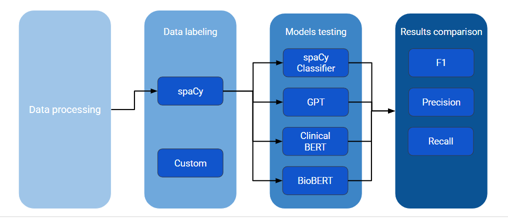
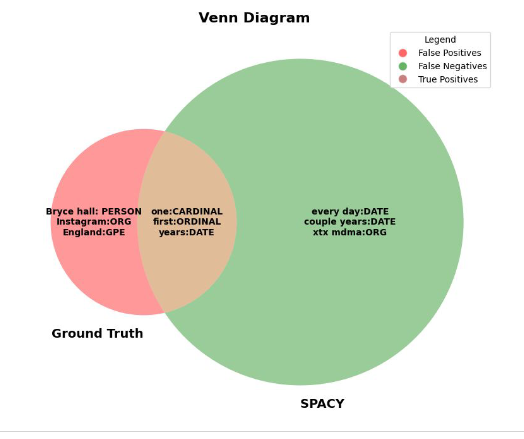
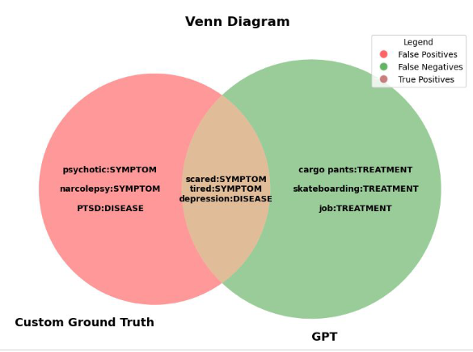
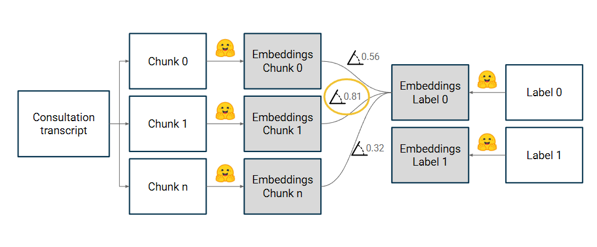

# Medical_NER
Using Spacy and Custom labels for Named-entity recognition. Trying to optimize the NER training and testing with BERT, GPT.

1. Spacy Classification 

    

        SpaCy Classification
    

    
→

    

        Grammar Checker
    

    
→

    

        Evaluation
    

    
→

    

        GPT Evaluation
    

    1. Grammar Checker using *LanguageTools*
    2. SPACY Labels 

    3. SPACY Evaluation for Manual Labels
    4. SPACY Evaluation with GPT 

2. Custom Labels 

    

        Custom Labels (TAG)
    

    
→

    

        Emtpy Spacy NER Classifier
    

    
→

    

        GPT Evaluation
    

    1. SPACY Classifier
    2. SPACY Fine-Tuning
    3. Evaluation with GPT

3. BERT Classification 

    

        BERT Classifier
    

    
→

    

        GPT Evaluation
    

